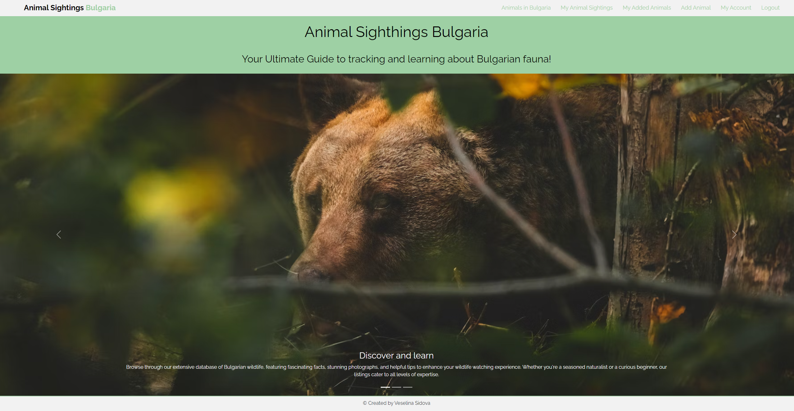

# Animal-Sightings-in-Bulgaria-SPA

This project is a Single Page Application (SPA) that allows users to view, add, and manage animals and animal sightings in Bulgaria. It's built using React and a [Softuni practice server](https://github.com/softuni-practice-server/softuni-practice-server) as the backend. The goal of this project is to raise awareness about the wildlife in Bulgaria and to help hobbyists track their sightings.

